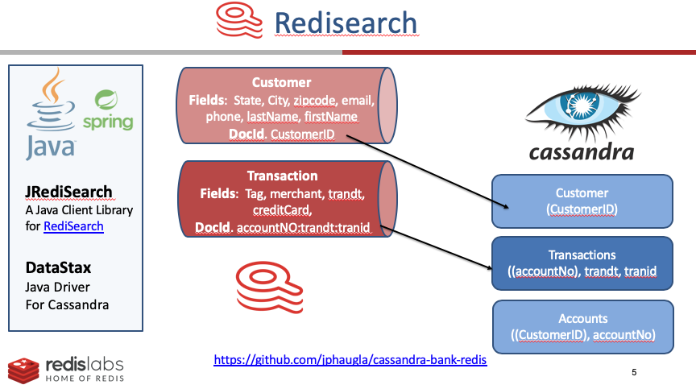

## Cassandra Bank day
This github integrates cassandra and redisearch.  Since many banks use cassandra, they can initially leverage their cassandra investment and use redisearch as and index and search capability on top of cassandra.  

### use docker compose to bring up the solution
```bash
docker-compose up -d
```

### This is a diagram of the solution


### Redisinsight is one of the docker containers
To access redinsight, use `http://localhost:8001/` in the browser
login using the redis  database name of `redis`

### To create the schema, run the following.  
```bash
cqlsh -u cassandra -p jph -f src/main/resources/cql/create_schema.cql 
```
### To compile the code use maven or intellij
```bash
mvn package
```

### To start the API layer, use runit script
```bash
./runit.sh
```
### To create the customers, accounts and transactions
Note: script can be modified to change the number of each entity to be created
This uses an API call to generate the data
```bash
./scripts/generateData.sh	
```
The api for the webservices are in the ./scripts directory each script may need to be customized depending on the amount of data generated.  
Each script has a short explanation.  To get initial values go to redinsight and use these queries.  
These are the scripts
[here](scripts)
In the Redsearch interface, from the dropdowns, select SEARCH, TRANSACTION and enter "@account_no:ACCT2" for the query.  Use these values for any transaction API's.  Next, select SEARCH, CUSTOMER and enter "@state_abbreviation:MN".

